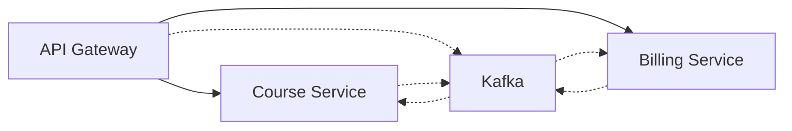
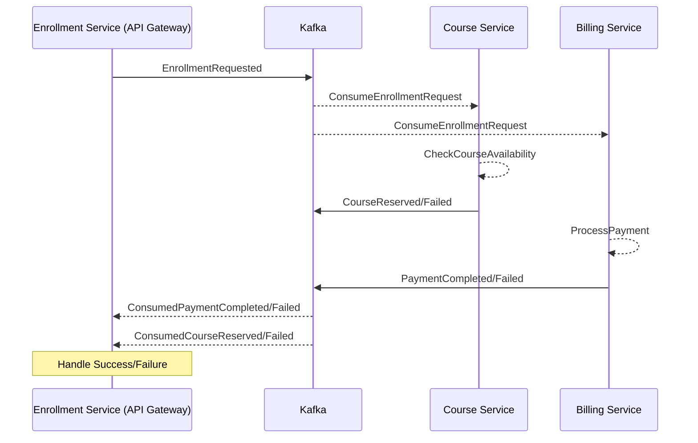

# Implement a Saga Pattern in a Microservices Architecture

# 🎓 Student Enrollment Saga Pattern Lab (2 Hours)

A hands-on lab implementing the Saga pattern in a microservices architecture for a student course enrollment system.

## 🎯 Objective

Implement a simple course enrollment system using the Choreography-based Saga pattern to handle distributed transactions across three microservices.

## 🏗 System Architecture



### Services Overview

1. **API Gateway**: Routes enrollment requests and manage enrollment status
2. **Course Service**: Manages course availability
3. **Billing Service**: Handles payment processing

## 🚀 Lab Steps

### Part 1: Setup

1. Clone the starter code:

   ```bash
   git clone git@github.com:do4-microservices/homeworks.git
   cd homeworks/labs/saga-enrollment
   ```

2. Start the project:
   ```bash
   docker-compose up --watch
   ```

### Part 2: Implementation (75 mins)

#### Step 1: Course Service (25 mins)

- Implement course availability check
- Handle seat reservation
- Publish events for success/failure
- Create an endpoint to retrieve course details

#### Step 2: Billing Service (25 mins)

- Process payment requests
- Handle payment status
- Publish payment events

#### Step 3: Api-Gateway Service (25 mins)

- Coordinate enrollment flow
- Listen for service events
- Handle compensation logic
- Create an endpoint to aggregate courses, payment and enrollments details

### Part 3: Testing (30 mins)

> [!TIP]
>
> - Use the provided comman din the Test section to simulate different scenarios. The payment/seat researvation should fail randomly.

#### Happy Path

1. Student requests enrollment
2. Course has seats available
3. Payment succeeds
4. Enrollment confirmed

#### Failure Scenario

1. Payment fails
   - Trigger compensation
   - Release course seat
   - Update enrollment status

## 📊 Evaluation Points

- Working implementation of the Saga pattern
- Proper event handling
- Basic error handling
- Successful compensation flow

## 📝 Project Structure

```
/saga-enrollment
├── api-gateway
│   └── main.go
├── course-service
│   └── main.go
├── billing-service
│   └── main.go
└── docker-compose.yml
```

## 🌟 Event Flow



## 💡 Implementation Tips

- Focus on the happy path first
- Implement basic compensation logic
- Keep error handling simple

## 🎯 Success Criteria

1. Successfully process an enrollment
2. Handle a payment failure scenario
3. Handle course reservation failure (e.g., no seats available)
4. Demonstrate compensation flow
5. Show event communication between services

> [!INFO] Compensation flow
>
> - The **API Gateway** should handle the compensation flow in case of a failure. If the payment has fail, it should notify the Course Service to release the reserved seat.

## Testing scenarios

### 1. Happy path: Send enrollment request

```bash
curl -X POST http://localhost:8080/api/enrollments \
  -H "Content-Type: application/json" \
  -d '{
    "studentId": "STU123",
    "courseId": "GO101",
    "paymentMethod": "CREDIT_CARD"
  }'

# Expected Response:
{
    "enrollmentId": "ENR789",
    "status": "PENDING",
}
```

Verify the status once the enrollment is processed.

```bash
# Check enrollment status
curl http://localhost:8080/api/enrollments/ENR789

# Expected Response:
{
    "status": "COMPLETED",
    "courseId": "GO101",
    "studentId": "STU123",
    "timestamp": "2024-01-04T..."
}
```

### 2. Payment Failure scenario: Simulate payment failure

```bash
curl -X POST http://localhost:8080/api/enrollments \
  -H "Content-Type: application/json" \
  -d '{
    "studentId": "STU456",
    "courseId": "GO101",
    "paymentMethod": "CREDIT_CARD"
  }'

# Expected Response:
{
    "enrollmentId": "ENR765",
    "status": "PENDING",
}

curl http://localhost:8080/api/enrollments/ENR765

# Expected Response:
{
    "status": "FAILED",
    "failureReason": "PAYMENT_FAILED",
    "courseId": "GO101",
    "studentId": "STU456",
    "timestamp": "2024-01-04T..."
}
```

### 3. Course Reservation Failure scenario: Simulate course reservation failure with no seats available

> [!TIP]
>
> - The course service should return an error when there are no seats available.

```bash

curl -X POST http://localhost:8080/api/enrollments \
  -H "Content-Type: application/json" \
  -d '{
    "studentId": "STU789",
    "courseId": "GO101",
    "paymentMethod": "CREDIT_CARD"
  }'

# Expected Response:
{
    "enrollmentId": "ENR007",
    "status": "PENDING",
}

curl http://localhost:8080/api/enrollments/ENR007

# Expected Response:
{
    "status": "FAILED",
    "failureReason": "COURSE_FULL",
    "courseId": "GO101",
    "studentId": "STU789",
    "timestamp": "2024-01-04T..."
}
```

### 4. Compensation flow + API composition: Simulate a payment failure, verify the compensation flow and the course details

```bash
curl http://localhost:8080/api/courses/GO101
{
    "courseId": "GO101",
    "name": "Go Programming",
    "seats": 2,
    "availableSeats": 1,
    "students": [
        {"id": "STU123"}
    ]
}
```
